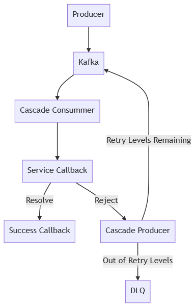

kafka-cascade is a lightweight library built on top of [kafkajs](https://kafka.js.org/) to provide automatic message reprocessing from services utilizing Kafka.

The basic flow of how kafka-cascade operates is as follows:


## Basic Usage
To create a kafka-cascade service you need to import the library:
```
const cascade = require('kafka');
const service = cascade.service(kafka, 'example-topic', 'example-group', serviceCB, successCB, dlqCB);
```
The `kafka` object is created from `kafkajs` and is passed into the service to create the consumer and producer required to process messages.

### Callbacks
The service callback should have the following signature:
`serviceCB(msg, resolve, reject)`
`msg` is the kafka message that the consumer is listening for. `resolve` and `reject` are the callbacks to provide message reprocessing.
`resolve` takes the `msg` as an argument and will call the success callback which can receive the `msg` as it's argument.
`reject` has the following signature: `reject(msg, status = '')`. Reject will either reprocess the message or call the dead letter queue (DLQ) callback which can receive the `msg` as it's argument.

### Retry Strategies
kafka-cascade supports two different retry strategies that can be set by calling `.setDefaultRoute` on the returned service.
Levels: specifies how many times a message should be retried before calling the DLQ callback. Each level can have it's own retry strategy.
 - Timeout Limit: specifies how long to wait before retrying the message
 - Batch LimitL specifies how many messages the producer should wait for before sending all of the messages to be retried at once

### Routes
kafka-cascade supports setting routes on the message retries for different status codes. By calling `.setRoute` on the service, kafka-cascade can utilize that route by suppling the status code when calling `reject` from the service callback

## Example
```
const cascade = require('kafka');

// create the service callback to simulate some time consumming task
const serviceCB = (msg, resolve, reject) => {
  performTimeConsumingTask(msg)
    .then(res => resolve(res))
    .catch(error => {
      if(error === 'timeout') reject(msg, error);
      else reject(msg);
    });
};

// the service callback will be called with any arguments passed in through the resolve callback
const successCB = (res) => {
  console.log('success:', res);
};

// the dead letter queue call back will be called when a message is out of retries
const dlqCB = (msg) => {
  console.log('failed:', msg);
}

// create a service with previously established kafka object
const service = await cascade.service(kafka, 'example-topic', 'example-group', serviceCB, successCB, dlqCB);

// establish a default route with a 5 levels and a timeout strategy
await service.setDefaultRoute(5, {timeoutLimit: [500, 1000, 2000, 4000, 8000]});

// establish a 'timeout' route which goes directly to the DLQ
await service.setRoute('timeout', 0);

// connect and start the service
await service.connect();
await service.run();
```
